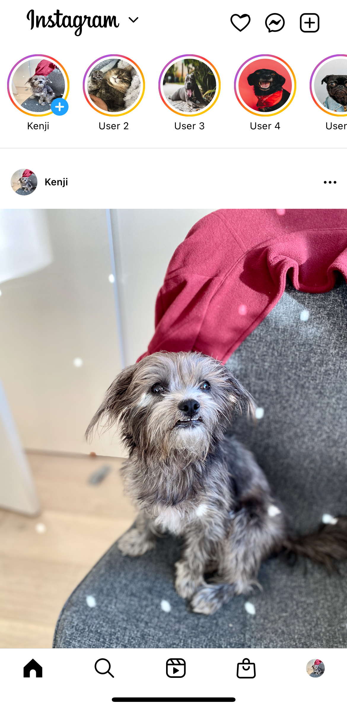

# Instagram

This is a clone of Instagram where I utilized a Figma Design in order to get the assets and the measurements. This was built using SwiftUI and allows for the user to scroll through the feed, and scroll through the stories. There is no functionality to this app other than the UI (maybe I will do something to it later).

## SwiftUI Building Blocks Used

- ScrollView (vertical and horizontal)
- Image and lots of working with the images
- Text and lots of working with the text
- VStack 
- HStack
- System Icons (SF Symbols)



## Getting Started

These instructions will get you a copy of the project up and running on your local machine for development and testing purposes.

### Prerequisites

You need to have the following installed on your machine

- Swift
- Xcode

### Installing

1. Clone the repository

```bash
git clone 
```

2. Run the project on Xcode

## Built With

* [Swift](https://developer.apple.com/swift/) - The programming language used
* [Xcode](https://developer.apple.com/xcode/) - The IDE used
* [Figma](https://www.figma.com/) - The design tool used
* [SwiftUI](https://developer.apple.com/xcode/swiftui/) - The framework used

## Special Thanks

* **Ashley Gaunt-Seo** - *Design* - [Figma](https://www.figma.com/community/file/878318142103232907/instagram-ui-kit-1-0)
